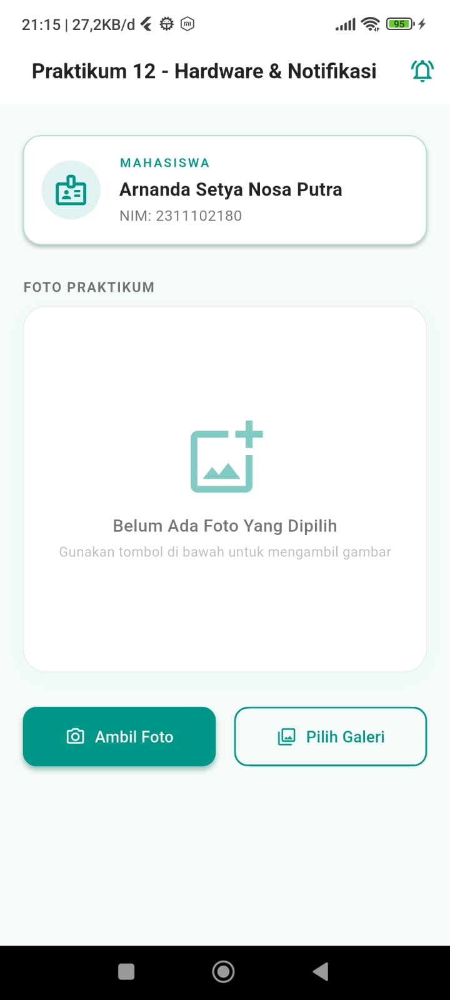
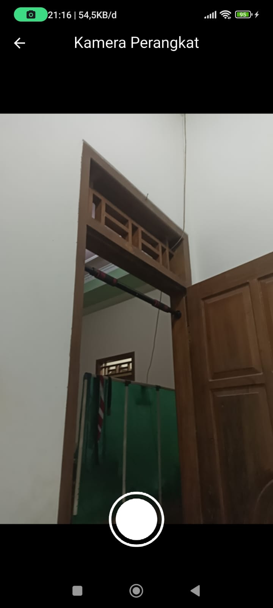
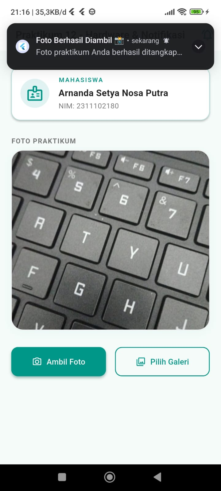
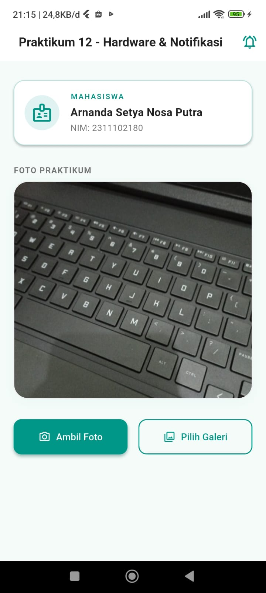
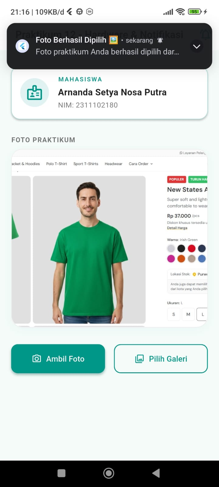

<div style="font-family: 'Times New Roman', Times, serif;">

<div align="center">
  <br />

  <h1>LAPORAN PRAKTIKUM <br>
  APLIKASI BERBASIS PLATFORM
  </h1>

  <br />

  <h3>TUGAS PERTEMUAN - 12<br>
    Praktikum Flutter — Notifikasi & API Perangkat Keras
  </h3>

  <br />

  

  <br />
  <br />
  <br />

  <h3>Disusun Oleh :</h3>

  <p>
    <strong>Arnanda Setya Nosa Putra</strong><br>
    <strong>2311102180</strong><br>
    <strong>S1 IF-11-04</strong>
  </p>

  <br />

  <h3>Dosen Pengampu :</h3>

  <p>
    <strong>Cahyo Prihantoro, S.Kom., M.Eng.</strong>
  </p>

  <br />

  <h3>LABORATORIUM HIGH PERFORMANCE
  <br>FAKULTAS INFORMATIKA <br>UNIVERSITAS TELKOM PURWOKERTO <br>2026</h3>
</div>

<hr>

## 1. Penjelasan Singkat

Pada tugas **Pertemuan 12** ini, praktikum berfokus pada integrasi **API Perangkat Keras (Kamera & Galeri)** dan sistem **Notifikasi Lokal (Local Notifications)** pada framework Flutter. Aplikasi didesain dengan konsep **cerah, simple, dan elegan** menggunakan skema warna Teal.

Konsep utama yang diterapkan:

1. **Camera API (Kamera Fisik)** : Menggunakan package `camera` untuk berinteraksi langsung dengan modul kamera belakang perangkat secara asinkron. Disediakan halaman khusus (`CameraScreen`) untuk menampilkan preview kamera langsung dan menangkap gambar secara real-time.
2. **Gallery Picker (Galeri Media)** : Menggunakan package `image_picker` untuk memicu interface galeri bawaan sistem operasi agar pengguna dapat memilih foto yang ada di memori eksternal/internal.
3. **Local Notifications** : Menggunakan package `flutter_local_notifications` untuk menampilkan push notification secara lokal di HP pengguna sesaat setelah foto berhasil diambil dari kamera ataupun dipilih dari galeri.
4. **Desain Cerah & Elegan (Bright & Elegant Theme)** : Mengimplementasikan antarmuka Material 3 bernuansa cerah bersih (`Color(0xFFF6FAFA)`) dengan kartu profil mahasiswa, area preview gambar berbingkai membulat modern, serta tombol aksi dengan gradasi/elevasi lembut.

---

## 2. Penjelasan Singkat Tiap Widget

Berikut adalah penjelasan widget utama yang digunakan dalam proyek ini:

1. **`MyApp`** (`StatelessWidget`):
   - Merupakan root widget dari aplikasi. Mengatur konfigurasi `MaterialApp`, tema visual utama (menggunakan `ColorScheme.fromSeed` berbasis warna `Colors.teal`), menonaktifkan banner debug, serta menetapkan `HomePage` sebagai halaman utama.

2. **`HomePage`** (`StatefulWidget`):
   - Halaman dashboard utama yang memegang state dari file foto yang dipilih (`_imageFile`). Widget ini memuat:
     - **Identity Card**: Kartu profil yang menampilkan identitas mahasiswa (Arnanda Setya Nosa Putra - 2311102180).
     - **Photo Preview Card**: Area untuk mempratinjau foto dengan border halus dan bayangan. Dilengkapi logika kondisional yang menampilkan pesan default jika belum ada foto, atau menampilkan gambar melalui `Image.file()` jika foto berhasil diperoleh.
     - **Action Buttons**: Barisan tombol di bagian bawah. Tombol "Ambil Foto" (`ElevatedButton`) untuk kamera langsung, dan tombol "Pilih Galeri" (`OutlinedButton`) untuk pemilih galeri.
     - **AppBar Action**: Tombol notifikasi di sudut kanan atas untuk menguji notifikasi lokal secara manual.

3. **`CameraScreen`** (`StatefulWidget`):
   - Halaman khusus untuk menangkap foto langsung menggunakan sensor kamera. Widget ini memuat:
     - **`FutureBuilder`**: Untuk memproses inisialisasi hardware kamera (`CameraController.initialize()`) secara asinkron sebelum preview ditampilkan.
     - **`CameraPreview`**: Widget bawaan package `camera` untuk memproyeksikan viewfinder sensor kamera ke layar HP.
     - **`InkWell` (Shutter Button)**: Tombol rana (shutter) bundar putih di bagian bawah untuk menangkap frame aktif kamera dan mengembalikannya ke halaman utama sebagai path file gambar.

---

## 3. Langkah-langkah Pembuatan Aplikasi

### Langkah 1 — Inisialisasi Project Flutter

Buat project Flutter baru di dalam direktori `tugas-12`:
```bash
flutter create --org com.arnandasetya.tugas12 --project-name tugas_12 .
```

---

### Langkah 2 — Tambahkan Dependencies di `pubspec.yaml`

Tambahkan library eksternal berikut untuk mengaktifkan fitur kamera, galeri, dan notifikasi lokal pada file `pubspec.yaml`:

```yaml
dependencies:
  flutter:
    sdk: flutter
  cupertino_icons: ^1.0.8
  camera: ^0.12.0+1
  image_picker: ^1.2.2
  flutter_local_notifications: ^21.0.0
```

Setelah itu, jalankan perintah untuk mengunduh package:
```bash
flutter pub get
```

---

### Langkah 3 — Konfigurasi Izin Sistem Android

1. Buka file `android/app/src/main/AndroidManifest.xml`, tambahkan izin untuk mengakses kamera dan memposting notifikasi (diperlukan untuk Android 13 ke atas) tepat di bawah tag `<manifest>`:
   ```xml
   <uses-permission android:name="android.permission.CAMERA" />
   <uses-permission android:name="android.permission.POST_NOTIFICATIONS" />
   ```

2. Buka file `android/app/build.gradle.kts`, tingkatkan `minSdk` menjadi `21` agar kompatibel dengan library `camera`, serta aktifkan fitur multidex dan desugaring:
   ```kotlin
   defaultConfig {
       minSdk = 21
       multiDexEnabled = true
   }
   
   compileOptions {
       isCoreLibraryDesugaringEnabled = true
   }
   
   dependencies {
       coreLibraryDesugaring("com.android.tools:desugar_jdk_libs:2.1.4")
   }
   ```

---

### Langkah 4 — Implementasi Source Code (`lib/main.dart`)

Implementasikan seluruh alur inisialisasi notifikasi, desain antarmuka cerah, tombol integrasi kamera/galeri, serta halaman kamera kustom di dalam berkas [main.dart](tugas-12/lib/main.dart).

---

## 4. Struktur File Proyek

Struktur folder akhir dari project `tugas-12` adalah sebagai berikut:

```
tugas-12/
├── android/
│   └── app/
│       ├── src/main/AndroidManifest.xml     ← konfigurasi izin hardware & notif
│       └── build.gradle.kts                 ← konfigurasi minSdk & dependencies
├── lib/
│   └── main.dart                            ← Entrypoint, HomePage, CameraScreen, & Logika Notifikasi
└── pubspec.yaml                             ← dependencies proyek
```

---

## 5. Cara Menjalankan Aplikasi

1. Aktifkan **USB Debugging** pada smartphone Android Anda dan hubungkan ke laptop menggunakan kabel data.
2. Buka terminal pada folder `tugas-12`.
3. Pastikan perangkat Anda terdeteksi dengan perintah:
   ```bash
   flutter devices
   ```
4. Jalankan aplikasi ke perangkat target:
   ```bash
   flutter run
   ```
5. Saat aplikasi terbuka untuk pertama kali, berikan izin ketika muncul pop-up izin untuk mengirimkan notifikasi dan menggunakan kamera.

---

## 6. Screenshot Hasil Tampilan

*(Tangkapan layar (screenshot) hasil pengujian diletakkan pada folder `SS`)*

<br>

<div align="center">

| No | Deskripsi Tampilan | File Gambar (Screenshot Anda) |
|:---:|:---|:---|
| 1 | Halaman Utama — Sebelum Memilih Foto |  |
| 2 | Halaman Kamera — Viewfinder Kamera Aktif |  |
| 3 | Tampilan Notifikasi — Muncul Setelah Foto Diambil |  |
| 4 | Halaman Utama — Setelah Foto Berhasil Diambil |  |
| 5 | Tampilan Notifikasi — Muncul Setelah Foto Dipilih Galeri |  |
| 6 | Halaman Utama — Setelah Foto Dipilih dari Galeri |  |

</div>

<br>

---

## 7. Kesimpulan

Pada praktikum Pertemuan 12 ini, telah berhasil diimplementasikan:
1. **Penggunaan API Perangkat Keras Kamera** melalui inisialisasi sensor langsung dan penyediaan viewfinder asinkron menggunakan widget `CameraPreview`.
2. **Pemanfaatan Image Picker** untuk memicu galeri media bawaan Android secara aman.
3. **Penyajian Notifikasi Lokal** secara instan di system tray Android setelah foto berhasil diambil atau dipilih, menggunakan channel notifikasi yang dikonfigurasi melalui `flutter_local_notifications`.
4. **Desain Antarmuka Cerah & Elegan** berbasis warna Teal dengan penekanan pada fungsionalitas, kegunaan, dan estetika minimalis modern demi memberikan pengalaman pengguna yang optimal.

</div>
